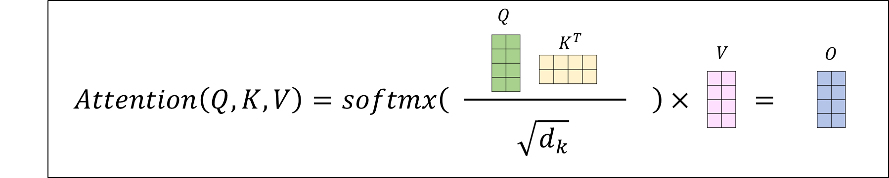
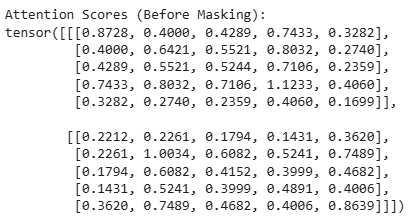
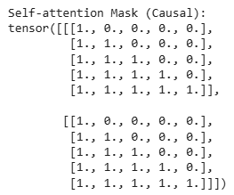
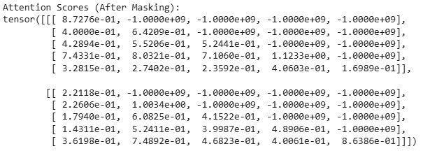

# 背景知识：从 Transformer 到 KV Cache

本文档是 Phase 2 的前置阅读材料，覆盖理解和实现 KV Cache 所需的背景知识。建议在开始 [phase2.md](phase2.md) 之前通读本文。

## 目录

- [Transformer 里 Self-Attention 每一步在算什么？](#transformer-里-self-attention-每一步在算什么)
- [Decoder-only 因果模型与 Causal Mask](#decoder-only-因果模型与-causal-mask)
- [推理两阶段：Prefill 与 Decode](#推理两阶段prefill-与-decode)
- [无 KV Cache 与有 KV Cache：生成效率的差异](#无-kv-cache-与有-kv-cache生成效率的差异)
- [KV Cache 的产业意义](#kv-cache-的产业意义)
- [Linear Attention：从「每步读全部历史」到「每步读固定状态」](#linear-attention从每步读全部历史到每步读固定状态)
- [Gated Delta Net：Qwen3.5 的线性注意力实现](#gated-delta-netqwen35-的线性注意力实现)
- [混合缓存：Full Attention 的 KV Cache 与 Linear Attention 的递推状态](#混合缓存full-attention-的-kv-cache-与-linear-attention-的递推状态)
- [延伸阅读](#延伸阅读)

---

## Transformer 里 Self-Attention 每一步在算什么？

讨论 **KV Cache** 之前，需要先弄清 **Self-Attention** 在算什么——它是 **Transformer** 里最主要的算力与访存来源之一。下面用最常见的 **Scaled Dot-Product Self-Attention**（参考论文：**Attention Is All You Need**），以**单头**为例，简单介绍 Transformer 的计算、访存构成。

**记号**：序列长度记为 $n$，隐藏维度记为 $d_{\mathrm{model}}$，单头维度记为 $d_k$（**多头**时通常令 $d_k = d_{\mathrm{model}} / h$，$h$ 为头数）。

1. **输入**
   某一子层输入为矩阵 $\mathbf{X} \in \mathbb{R}^{n \times d_{\mathrm{model}}}$，每一行是一个 **token** 的向量表示。

2. **线性投影得到 Q、K、V**
   $\mathbf{Q} = \mathbf{X}\mathbf{W}^Q,\quad \mathbf{K} = \mathbf{X}\mathbf{W}^K,\quad \mathbf{V} = \mathbf{X}\mathbf{W}^V$
   **Query** 和 **Key** 用于计算注意力分数（权重），归一化后的分数乘以 **Value** 得到注意力输出。

3. **注意力分数**
   计算 $\dfrac{\mathbf{Q}\mathbf{K}^\top}{\sqrt{d_k}}$，得到 $\mathbb{R}^{n \times n}$：第 $i$ 行第 $j$ 列表示「位置 $i$ 的 query 与位置 $j$ 的 key 有多像」。除以 $\sqrt{d_k}$ 防止点积方差过大。

4. **Softmax 归一化**
   对**每一行**做 softmax，得到注意力权重 $\mathbf{A} \in \mathbb{R}^{n \times n}$，行和为 1。在因果设定下还会加 Causal Mask（见下节）。

5. **加权聚合 Value**
   $\mathbf{O} = \mathbf{A}\mathbf{V}$，形状 $\mathbb{R}^{n \times d_k}$。

6. **多头情况（Multi-Head Attention）**
   拆成 $h$ 个子空间分别做步骤 3–5，结果拼接后乘输出矩阵 $\mathbf{W}^O$，维度回到 $d_{\mathrm{model}}$。

**Self-Attention**计算过程图示
<p align="center">
  
</p>

**复杂度**：$\mathbf{Q}\mathbf{K}^\top$ 是 $O(n^2 d_k)$，序列一长，$n^2$ 就是「长上下文贵」的主要来源，也是 Linear Attention 和 KV Cache 要解决的问题的出发点。

---

## Decoder-only 因果模型与 Causal Mask

**KV Cache** 能成立，依赖于 **Decoder-only** 类模型（GPT、LLaMA、Qwen 等）里的**因果（causal）**设定：每个位置在计算 attention 时**只依赖其前文**，不依赖未来 token。实现上用**下三角掩码**：对上三角位置置为 $-\infty$，经 softmax 后权重为 0。

**Causal Mask 的作用过程**：

1. **Mask 前**：$\mathbf{Q}\mathbf{K}^\top$ 整块都有数值，每个位置可看到所有其他位置。

   <p align="center">
   
   </p>

2. **Mask 矩阵**：下三角（含对角）为"允许"，上三角为"屏蔽"。

   <p align="center">
   
   </p>

3. **Mask 后**：上三角等价为 $-\infty$，softmax 后权重为 0，只保留下三角。

   <p align="center">
   
   </p>

**为什么因果性使 KV Cache 成立**：前缀一旦确定，各历史位置的输入隐状态 $\mathbf{X}$（每一行）只由已出现的 token 决定，后续生成新 token 不会改变它。因此 $\mathbf{K}=\mathbf{X}\mathbf{W}^K$、$\mathbf{V}=\mathbf{X}\mathbf{W}^V$ 在后续步里**保持不变，可以安全缓存**。

> 为什么不缓存 Q？因为 Q 不会被复用——每步只有最新 token 的 Q 参与计算。

---

## 推理两阶段：Prefill 与 Decode

| 阶段 | 在做什么 | 典型特征 |
|------|----------|---------|
| **Prefill（预填充）** | 对用户输入的 prompt **并行**跑一遍模型，建立各层 KV Cache，得到第一个生成 token | **计算密集**：一次性处理长上下文，吃满算力 |
| **Decode（解码）** | 基于 KV Cache **自回归**：每次前向只新增一个 token，直到停止 | **访存密集**：每步要读取整个模型权重 + 不断增长的历史 K/V |

两阶段负载侧重点不同，也是后来 **Prefill/Decode 分离调度**、**Paged Attention** 等工作的出发点。

---

## 无 KV Cache 与有 KV Cache：生成效率的差异

Prefill 阶段有无 KV Cache 差别不大——核心差异在 Decode：

- **无 KV Cache（朴素自回归）**：每生成一个 token，就把整段序列重新喂入模型，所有位置的 Q、K、V 反复重算。等价于每吐出一个 token 就对越来越长的前缀重做 Prefill，冗余极大。
- **有 KV Cache**：每步只输入刚生成的那个 token，从缓存读历史 K/V，只为新位置算 Q 及本步 K/V，然后进行 attention 计算。

因此 KV Cache 对生成效率的改善**集中体现在 Decode**，让其从「每步全序列重算」变为「每步只算新 token + 读缓存」。

更多知识与简易代码实现，可见 Hugging Face 博文：[KV Caching Explained](https://hf-mirror.com/blog/not-lain/kv-caching)。

---

## KV Cache 的产业意义

KV Cache 是大模型推理成本里的核心构成：

- **显存**：长上下文场景下，KV Cache 常占推理显存的大头。
- **算力与带宽**：即使不重算历史 K/V，每步仍要读取很长的 K/V 做矩阵乘，内存带宽成为瓶颈。

因此有大量研究针对「KV Cache 太长、太贵」展开：**KV Cache 量化**、**稀疏**、**Paged Attention**、**线性注意力**等等。

其中**线性注意力**是一种从根本上改变注意力计算方式的方案——不再逐对匹配所有历史 token，而是将历史信息压缩到一个**固定大小的状态矩阵**中。Qwen3.5 正是把这种方案与传统 Full Attention 混合使用的代表。

---

## Linear Attention：从「每步读全部历史」到「每步读固定状态」

### 标准注意力在推理时到底贵在哪？

需要分两个阶段理解开销：

- **Prefill 阶段**：$\mathbf{Q}$ 的形状是 $n \times d_k$，$\mathbf{Q}\mathbf{K}^\top$ 产出 $n \times n$ 的注意力矩阵，计算量是 $O(n^2 d_k)$，prompt 越长 prefill 越慢。
- **Decode 阶段（有 KV Cache）**：每步只有 1 个新 token 的 query，即 $\mathbf{q} \in \mathbb{R}^{1 \times d_k}$，与缓存中所有历史 K 做点积，得到 $1 \times n$ 的注意力向量——**每步计算是 $O(n \cdot d)$，不是 $O(n^2)$**。

那 decode 阶段是不是就不贵了？并非如此。随着生成序列不断变长，**KV Cache 不断增长**，每步都要读取越来越长的历史 K/V，访存量线性增长，且每步都要稳定读取整个模型权重进行计算。在当下 AI 上下文快速膨胀的场景下，这对算力、内存带宽、显存都带来较大压力。

### Linear Attention 的核心思想

**Linear Attention** 的出发点：能不能让 decode 每步的开销**完全不随历史长度增长**？

标准注意力计算顺序是 $(\mathbf{Q} \cdot \mathbf{K}^\top) \cdot \mathbf{V}$。去掉 softmax（或替换为可分解核函数 $\phi$），利用矩阵乘法**结合律**改变计算顺序：

$$\mathbf{O} = \phi(\mathbf{Q}) \cdot \bigl(\phi(\mathbf{K})^\top \cdot \mathbf{V}\bigr)$$

先算 $\phi(\mathbf{K})^\top \cdot \mathbf{V}$，得到 $d_k \times d_v$ 的矩阵（与序列长度 $n$ 无关），再用 $\phi(\mathbf{Q})$ 读取。这个 $d_k \times d_v$ 的中间结果就是**固定大小的"记忆矩阵" $\mathbf{S}$**，可以逐步递推：

$$\mathbf{S}_t = \mathbf{S}_{t-1} + \mathbf{k}_t \mathbf{v}_t^\top, \qquad \mathbf{o}_t = \mathbf{q}_t^\top \, \mathbf{S}_t$$

每来一个新 token，只需把 $\mathbf{k}_t \mathbf{v}_t^\top$ 加到状态矩阵，再用 $\mathbf{q}_t$ 查询，**开销恒为 $O(d_k \cdot d_v)$**——线性注意力本质等价于**线性 RNN**。

**decode 阶段的关键对比**：
- **Full Attention + KV Cache**：$\mathbf{q}$ 与所有历史 K 做点积 → 读取 $O(n)$ 的 KV Cache → **开销随历史增长**
- **Linear Attention + 递推状态**：$\mathbf{q}$ 与固定大小的 $\mathbf{S}$ 做乘法 → 读取 $O(d^2)$ 的状态 → **开销恒定**

### 优点与缺点

| | **Full Attention（标准 softmax）** | **Linear Attention（递推式）** |
|---|---|---|
| **Prefill 复杂度** | $O(n^2 d)$ | $O(n d^2)$ |
| **Decode 每步复杂度** | $O(n d)$（读取所有历史 KV） | $O(d^2)$（只读固定状态矩阵） |
| **缓存大小** | $O(n)$，随序列线性增长 | $O(d^2)$，**固定**，与 $n$ 无关 |
| **精确回忆能力** | 强：可精确查看任意历史 token | 弱：历史被压缩到定长状态，细节丢失 |
| **长上下文支持** | 受限于 KV Cache 显存 | 天然友好（状态大小恒定） |
| **典型弱点场景** | 上下文 > 128K 时显存爆炸 | 精确复制、逐字回忆等场景 |

**总结**：Linear Attention 用**有损压缩**换取了**恒定的推理开销**——把不断增长的 KV Cache 替换为固定大小的状态矩阵。擅长处理长序列中的模式和趋势，但在需要精确检索某个历史 token 的任务上不如标准注意力。

### 朴素 Linear Attention 的问题

简单递推 $\mathbf{S}_t = \mathbf{S}_{t-1} + \mathbf{k}_t \mathbf{v}_t^\top$ 存在明显缺陷（也是过去 RNN 的通病）：

1. **只增不减**：状态只做累加，无法遗忘过时信息，旧关联会干扰新查询。
2. **信息覆盖困难**：同一个 key 在不同位置关联了不同 value（如变量被重新赋值），朴素累加无法正确覆盖。
3. **表达力受限**：缺少 softmax 的归一化，数值稳定性和"聚焦"能力都较弱。

这些问题催生了 **DeltaNet** 和 **Gated Delta Net**——也正是 Qwen3.5 所采用的方案。

---

## Gated Delta Net：Qwen3.5 的线性注意力实现

> 选读，不影响 Phase 2 的代码实现。感兴趣可阅读相关论文。

### 从朴素累加到 Delta Rule

**DeltaNet**（Yang et al., 2024）借鉴经典的 **Delta Rule（误差修正规则）**，将朴素累加改为**带纠错的更新**：

$$\mathbf{S}_t = \mathbf{S}_{t-1} + \beta_t \, \mathbf{k}_t \bigl(\mathbf{v}_t - \mathbf{S}_{t-1}^\top \mathbf{k}_t\bigr)^\top$$

解读：
- $\mathbf{S}_{t-1}^\top \mathbf{k}_t$：用当前 key 从记忆中**检索**出旧 value
- $\mathbf{v}_t - \mathbf{S}_{t-1}^\top \mathbf{k}_t$：真实 value 与检索值的**误差（delta）**
- $\beta_t$：**更新门**（0～1），控制写入强度
- 整体：只把「记忆中还没有的部分」写入，而不是盲目累加

### 再加上门控遗忘：Gated Delta Net

**Gated Delta Net**（Yang, Kautz & Hatamizadeh, ICLR 2025）增加了**指数衰减门控** $\alpha_t$：

$$\mathbf{S}_t = e^{\alpha_t}\,\mathbf{S}_{t-1} \;+\; \beta_t\,\mathbf{k}_t\bigl(\mathbf{v}_t - \mathbf{S}_{t-1}^\top \mathbf{k}_t\bigr)^\top$$

- $e^{\alpha_t}$（$\alpha_t < 0$）：**遗忘门**，让旧状态按指数衰减，可快速「清空」记忆
- $\beta_t = \sigma(b_t)$：**更新门**，选择性写入

两门联合使模型同时具备**选择性遗忘**和**选择性写入**能力。

### Qwen3.5 中的完整前向过程

1. **线性投影**：隐状态投影得到 Q、K、V，以及门控参数 $a$（计算 $\alpha$）和 $b$（计算 $\beta$）
2. **因果 1D 卷积**（kernel=4）：Q/K/V 先过卷积，捕获局部上下文（替代 RoPE，详见下方）
3. **L2 归一化**：对 Q 和 K 做 L2 归一化（替代 softmax 缩放）
4. **门控参数**：$\alpha_t = -\exp(A) \cdot \mathrm{softplus}(a_t + \mathrm{dt\_bias})$，$\beta_t = \sigma(b_t)$
5. **Delta Rule 递推**：更新状态矩阵 $\mathbf{S}$，输出 $\mathbf{o}_t = \mathbf{q}_t^\top \mathbf{S}_t$
6. **RMSNorm + SiLU 门控输出**

推理时第 5 步有两条路径（也是 Phase 2 的实现核心）：
- **Prefill**：`torch_chunk_gated_delta_rule`，chunk_size=64 分块并行，块间传递递推状态
- **Decode**（每次 1 个 token）：`torch_recurrent_gated_delta_rule`，从缓存的状态出发逐步递推

### 因果 1D 卷积：Linear Attention 的局部位置感知

在 Full Attention 中，**RoPE（旋转位置编码）** 让模型知道两个 token 之间的相对距离。Linear Attention 没有 softmax 注意力矩阵，无法直接套用 RoPE，改用一个**因果 1D 卷积**来捕获局部上下文。

**直觉**：卷积核大小为 4，意味着每个 token 的 Q/K/V 表示都融合了它**自身及前 3 个 token** 的信息。这提供了一种轻量的局部位置感知，相当于让模型"看"一个小窗口。

**为什么是「因果」的**：普通 1D 卷积是双向的（左右各看），但语言模型不能看未来。因果卷积通过**只在左侧 padding**（不在右侧补零）来保证每个位置只依赖其左侧历史，不看未来 token。

**Prefill vs Decode 的处理方式不同**，这是 Phase 2 中需要实现的核心分支之一：

- **Prefill**（处理整段 prompt，seq_len > 1）：直接对整个序列做一次完整的 1D 卷积。
  同时把卷积输入的**最后 `kernel_size` 个时间步**保存下来作为 `conv_state`，供后续 decode 步使用：

  ```python
  # Prefill: 做完整卷积，并保存末尾 kernel_size 帧作为状态
  conv_state = F.pad(mixed_qkv, (kernel_size - seq_len, 0))  # 保留最后 4 帧
  mixed_qkv = F.silu(conv1d(mixed_qkv)[:, :, :seq_len])
  ```

- **Decode**（每次只有 1 个新 token，seq_len = 1）：不能重新跑完整卷积，改用滑动窗口更新。
  把新 token 拼到 `conv_state` 右端，挤出最旧的一帧，再做一次卷积：

  ```python
  # Decode: 将新 token 拼入窗口，conv_state 原地更新（滑动）
  hidden_new = cat([conv_state, new_token], dim=-1)   # shape: (B, C, kernel_size+1)
  conv_state.copy_(hidden_new[:, :, -kernel_size:])   # 保留最新 4 帧
  out = F.silu(F.conv1d(hidden_new, weight, ...))     # 只取最后 1 帧输出
  ```

**`conv_state` 就是这个滑动窗口的快照**：大小始终为 `(batch, conv_dim, kernel_size)`，不随序列增长，每 decode 一步就滑动更新一次。这就是 Linear Attention 缓存中 `conv_state` 的来源和含义。

### 为什么 Qwen3.5 要「混合」而非全用 Linear Attention？

Qwen3.5 采用 **3:1 混合比例**（每 3 层 Linear Attention 配 1 层 Full Attention）：

- **Linear Attention 的固有弱点**：固定大小的 $\mathbf{S}$ 无法无损保留所有历史细节，精确检索场景（"大海捞针"）表现不足。
- **Full Attention 作为精确检索锚点**：每 4 层有 1 层可精确查看任意历史 token。
- **互补的效率**：75% 的层状态恒定，仅 25% 的层需要维护增长的 KV Cache，整体 KV Cache **只有纯 Full Attention 模型的 ¼**。

官方报告：32K 上下文时比纯 Full Attention 快 **8.6 倍**，256K 时快 **19 倍**，推理质量几乎无损。

---

## 混合缓存：Full Attention 的 KV Cache 与 Linear Attention 的递推状态

Phase 2 中你将实现的 `Qwen3_5DynamicCache`，需要为两种注意力层维护**不同形式的缓存**：

### Full Attention 层：KV Cache

- **存储内容**：每层每个 head 的历史 Key 和 Value 向量
- **形状**：`(batch, num_heads, seq_len, head_dim)`
- **更新**：每 decode 一个新 token，沿 `seq_len` 维度**拼接**新的 K 和 V
- **大小**：随序列长度**线性增长**

> **关于 `batch` 维度**：本项目的推理引擎每次只处理一条请求，`batch` 始终为 1。但它不能被省略——PyTorch 的批量矩阵乘（`torch.matmul` 作用于 4D 张量时）将 dim 0 和 dim 1 统一视为批次维，去掉后 `num_heads` 会被误认为 batch，导致维度语义错乱。在生产部署（如 vLLM）中，`batch = N` 表示同时为 N 个用户做推理，KV Cache 内存管理（Paged Attention 等）的复杂性正来源于此。

### Linear Attention 层：Conv State + Recurrent State

**1. 递推状态 `recurrent_state`（记忆矩阵 $\mathbf{S}$）**

- **内容**：Gated Delta Net 的隐状态矩阵，所有已处理 token 的压缩表示
- **形状**：`(batch, num_heads, key_head_dim, value_head_dim)`，如 `(1, 32, 128, 128)`
- **更新**：每步执行一次 Delta Rule 递推，**原地替换**（不拼接、不增长）
- **大小**：**恒定**，与已处理 token 数量无关

**2. 卷积状态 `conv_state`（滑动窗口）**

- **内容**：因果 1D 卷积的滑动窗口，保存最近 `kernel_size`（=4）个 token 的中间投影表示（Q/K/V 拼接后的向量），是linear attention计算的一部分
- **形状**：`(batch, conv_dim, kernel_size)`，其中 `conv_dim = 2 * key_dim + value_dim`
- **更新**：新 token 滑入右端、最旧 token 从左端出队，类似定长队列；decode 每步就地 `copy_` 更新，不分配新内存
- **大小**：**恒定**（永远只保存最近 4 个时间步，无论已生成多少 token）
- **与 KV Cache 的本质区别**：`conv_state` 只提供局部位置感知，不保存全局历史；真正的「历史记忆」由 `recurrent_state` 承载

### 对比总结

| | **Full Attention 缓存** | **Linear Attention 缓存** |
|---|---|---|
| **存什么** | 所有历史 token 的 K/V 向量 | 固定大小的记忆矩阵 $\mathbf{S}$ + 卷积滑动窗口 |
| **大小** | $O(\text{seq\_len})$，持续增长 | $O(d_k \times d_v)$，**始终恒定** |
| **更新方式** | 新 K/V 拼接到末尾 | 递推公式原地更新 |
| **查询方式** | $\mathbf{q}$ 与所有历史 $\mathbf{K}$ 做点积 | $\mathbf{q}^\top \mathbf{S}$ 直接读状态 |
| **信息保真度** | 无损 | 有损（历史被压缩） |
| **每步推理代价** | $O(n \cdot d)$，随历史变长 | $O(d^2)$，恒定 |

在 Qwen3.5 中，这两种缓存**共存于同一个 `Qwen3_5DynamicCache` 对象**，根据每层的 `layer_type` 决定使用哪种方式——这就是"混合缓存"的含义。

---

## 延伸阅读

| 主题 | 说明 |
|------|------|
| 系统课程（感兴趣可看） | 斯坦福 **CS336**（从大模型原理到实现，含中英字幕）— [Bilibili](https://www.bilibili.com/video/BV1Ect2zjEHR) |
| **Transformer** 论文 | *Attention Is All You Need* — [arXiv:1706.03762](https://arxiv.org/abs/1706.03762) |
| **Transformer** 官方博客 | Hugging Face 文档 — [Transformer 模型](https://hf-mirror.com/learn/llm-course/zh-CN/chapter1/1) |
| **Transformer** 架构解析 中文博客 | [知乎专栏](https://zhuanlan.zhihu.com/p/338817680) |
| **Decoder-only** 推理流程 中文博客 | [掘金网站博客](https://juejin.cn/post/7576369868417630244) |
| **KV Cache** 入门 | 图示与代码 — [hf-mirror](https://hf-mirror.com/blog/not-lain/kv-caching) |
| **Gated Delta Net** 论文 | *Gated Delta Networks: Improving Mamba2 with Delta Rule* — [arXiv:2412.06464](https://arxiv.org/abs/2412.06464) |
| **DeltaNet** 论文 | *Parallelizing Linear Transformers with the Delta Rule* — [arXiv:2406.06484](https://arxiv.org/abs/2406.06484) |
| **DeltaNet** 原理解读 | 作者博客（英文，含动画）— [Songlin Yang's Blog](https://sustcsonglin.github.io/blog/2024/deltanet-1/) |
| **注意力变体**可视化 | 含 Linear、DeltaNet、Mamba 对比 — [Sebastian Raschka](https://magazine.sebastianraschka.com/p/visual-attention-variants) |
| **Qwen3.5 混合注意力**解读 | "Nobody Agrees on Attention Anymore" — [HuggingFace Blog](https://huggingface.co/blog/mlabonne/qwen35) |
| **Qwen3.5-0.8B** 模型卡 | [Hugging Face](https://hf-mirror.com/Qwen/Qwen3.5-0.8B) |
| Qwen3.5 官方介绍 | [Qwen 博客](https://qwen.ai/blog?id=qwen3.5) |
